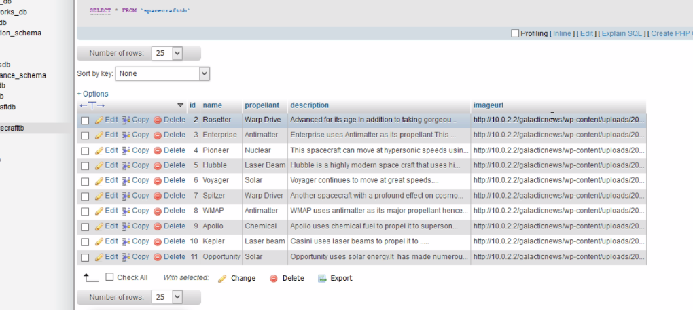
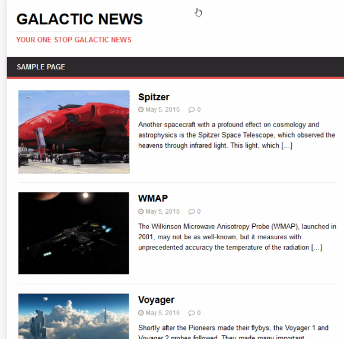
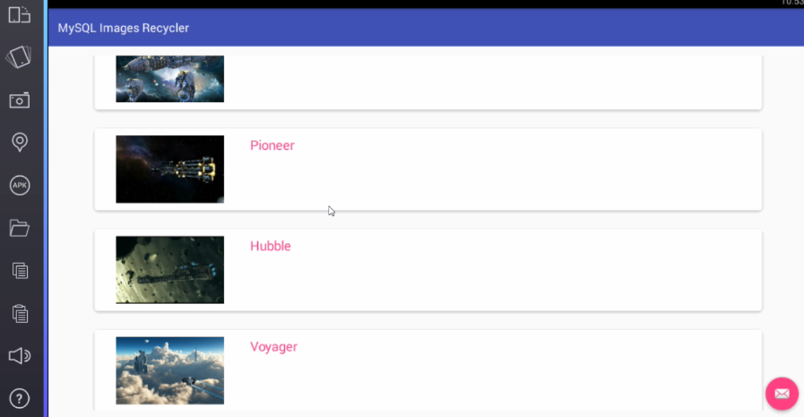

# MySQL_Images_RecyclerView
Retrieve images and text from MySQL Database and show in RecyclerView.

* The Table Structure

* Android MySQL Images and RecyclerView Example
* Retrieve data from MySQL database and bind to a custom RecyclerView.
* The data shall consist of names as well as image urls.
* We then asynchronously load images via Picasso library.
* While loading images we show a placeholder or if network is down.
* We use AsyncTask class for our threading needs.

* We load images from a website.

* We bind data to RecyclerView.

Cheers,Oclemy.
